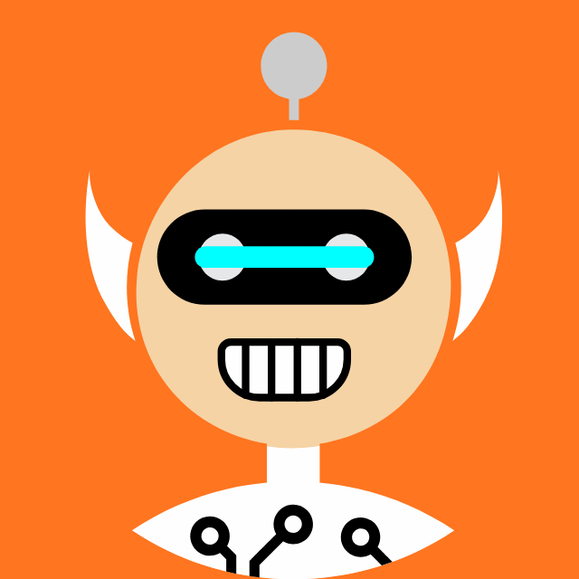

# multiavatar-reanimated-react-native

A customizable, animated avatar component for React Native + Expo. Backed by a
single Rive runtime with full data-binding (16 swappable shapes per part, color
binds for hair / clothes / eyes / mouth / skin, plus `yes` / `no` state-machine
triggers). Cross-platform — falls back to an SVG composer on the web.

The shape catalog (16 characters × 4 parts) is adapted from
[multiavatar.com](https://multiavatar.com) by Gie Katon. The original
multiavatar SVG library generates pseudo-random avatars from a seed; this
package picks 16 of those shapes, exposes them as a switchable, color-bindable
Rive artboard, and wraps them in React components for easy reuse. Big thanks
to multiavatar.com for the original artwork — without it this wouldn't exist.

MIT licensed.

## Preview

Four variations × three states. The yes / no clips fire the `yes` and `no`
Rive triggers ~200ms in.

|   | idle (10s loop) | yes (1s) | no (1s) |
| - | --------------- | -------- | ------- |
| **default** (Robo, default colors) |  |  |  |
| **spy** (Country / Firehair / Female / Older, greys) |  |  |  |
| **tips** (all Meta, metallic eye accent) |  |  |  |
| **toned-warm** (Older / Blond / Blond / Firehair, muted) |  |  |  |

## Install

The package is published to **GitHub Packages**. Add this to your project's
`.npmrc` (or `~/.npmrc`):

```
@michalkurzewski:registry=https://npm.pkg.github.com
//npm.pkg.github.com/:_authToken=${GITHUB_TOKEN}
```

`GITHUB_TOKEN` is any classic Personal Access Token with the `read:packages`
scope (https://github.com/settings/tokens). Then install:

```sh
bun add @michalkurzewski/multiavatar-reanimated-react-native
# or
npm install @michalkurzewski/multiavatar-reanimated-react-native
```

Peer dependencies (install at versions matching your app):

- `react`, `react-native`
- `@rive-app/react-native` (Rive runtime — reads the bundled `.riv`)
- `react-native-svg` (web fallback + editor thumbnails)
- `zustand` (internal store)
- `@react-native-async-storage/async-storage` (only if you wire AsyncStorage as
  the persistence adapter — optional)

### Metro / .riv asset

The package ships its own `assets/avatar.riv`. Make sure your Metro config
includes `riv` in `resolver.assetExts`:

```js
// metro.config.js
const config = getDefaultConfig(__dirname);
config.resolver.assetExts = [...config.resolver.assetExts, "riv"];
module.exports = config;
```

## Quick start — store mode

Wrap your app in `<AvatarProvider />`, optionally with a storage adapter, then
drop in `<UserAvatar />` anywhere.

```tsx
import {
  AvatarProvider,
  type AvatarStorageAdapter,
  UserAvatar,
} from "multiavatar-reanimated-react-native";
import { MMKV } from "react-native-mmkv";

const mmkv = new MMKV();
const storage: AvatarStorageAdapter = {
  getItem: (key) => mmkv.getString(key) ?? null,
  setItem: (key, value) => mmkv.set(key, value),
};

export default function App() {
  return (
    <AvatarProvider storage={storage}>
      {/* …rest of app… */}
      <UserAvatar size={84} />
    </AvatarProvider>
  );
}
```

State is persisted under the key `multiavatar.user_avatar.v1` (override with
`storageKey`). Omit `storage` and the avatar lives in memory only.

## Editor

`<AvatarEditor />` is an embeddable card — drop it inside your own modal /
sheet. It reads and writes the active avatar through the provider.

```tsx
import { AvatarEditor } from "multiavatar-reanimated-react-native";

<MyModal visible={open} onClose={() => setOpen(false)}>
  <AvatarEditor
    onClose={() => setOpen(false)}
    theme={{
      background: "#fff",
      border: "#e5e5e5",
      text: "#1a1a1a",
      accent: "#1a1a1a",
      buttonBackground: "#1a1a1a",
      buttonText: "#fff",
    }}
  />
</MyModal>;
```

The editor exposes:

- 4 shape tabs (Top / Clothes / Eyes / Mouth) with 16-shape circular thumbnail
  grid; each thumbnail zooms in on the active part.
- Skin and Background color tabs.
- Per-part Main + (when applicable) Accent color pickers. Single-color shapes
  auto-collapse to Main only.
- Mouth slot picker uses the labels "Lips" + "Facial hair" and treats white as
  uncontrollable teeth.
- Save / Cancel buttons appear once the user makes a change; otherwise a single
  Close button.

## Triggers — yes / no reactions

The bundled Rive artboard has two state-machine triggers: `yes` (celebration)
and `no` (negative reaction). Every Rive avatar mounted under the provider
plays these whenever you bump the corresponding counter:

```tsx
import { useAvatarTriggers } from "multiavatar-reanimated-react-native";

function GameLoop() {
  const { triggerNo, triggerYes } = useAvatarTriggers();

  function onWrongAnswer() { triggerNo(); }
  function onWin() { triggerYes(); }
}
```

Trigger fan-out is automatic — render `<UserAvatar>`, `<SpyAvatar>`, etc.
anywhere and they all react together.

## Controlled mode

If you don't want the provider, use `<RiveAvatar>` directly with a
`CustomAvatar` value:

```tsx
import { RiveAvatar, DEFAULT_AVATAR } from "multiavatar-reanimated-react-native";

<RiveAvatar avatar={DEFAULT_AVATAR} size={84} />;
```

You manage state, persistence, and triggers yourself.

## Presets

Hardcoded character variants you can drop in unchanged:

- `<SpyAvatar size={64} />` — mysterious greyish silhouette using the
  `Country / Firehair / Female / Older` shape combo with grey color binds.
- `<TipsAvatar size={64} />` — neutral grey "all Meta" character with a
  metallic silver-blue eye accent.

## API reference

### Components

| Component | Mode | Use case |
| --- | --- | --- |
| `<UserAvatar size />` | store-driven | Render the active user's avatar |
| `<RiveAvatar avatar size />` | controlled | One-off avatar with explicit value |
| `<SpyAvatar size />` | preset | Mystery / unknown user |
| `<TipsAvatar size />` | preset | Help / hint character |
| `<AvatarEditor onClose theme onDraftChange maxWidth />` | store-driven | Customization UI |
| `<AvatarProvider storage storageKey initialAvatar children />` | — | Wrap your app |

### Hooks

| Hook | Returns |
| --- | --- |
| `useAvatar()` | `{ avatar, setAvatar, setAvatarPart }` |
| `useAvatarTriggers()` | `{ triggerNo, triggerYes }` |
| `useAvatarGenerations()` | `{ no, yes }` (raw counters) |
| `useAvatarMistakeTrigger(canRender, riveViewRef)` | imperative fire on counter bumps |
| `useAvatarWinTrigger(canRender, riveViewRef)` | imperative fire on counter bumps |
| `useFadeInOpacity(visible, duration?)` | `Animated.Value` for fade-in helpers |
| `useSharedAvatarRiveFile()` | `{ riveFile, isLoading, error }` — module-level cache |

### Utility / data

- `DEFAULT_AVATAR`, `SPY34_AVATAR` — example `CustomAvatar` values.
- `AVATAR_SHAPES` — readonly list of the 16 shape names.
- `EDITABLE_PARTS` — `["top", "clo", "eyes", "mouth"]`.
- `BACKGROUND_PALETTE`, `SKIN_PALETTE`, `HAIR_PALETTE`, `COLOR_PALETTE` — picker palettes.
- `composeAvatarSvg(avatar)` — compose a full multiavatar SVG string.
- `renderShapeThumbnailSvg(avatar, part, candidateShape, candidateColors)` — same as compose, with one part swapped and the viewBox cropped to the part's region (used by the editor's thumbnails).
- `getDefaultPartColors(shape, part)` / `getPartRiveBindingColors(shape, part, colors)` — helpers used internally; also useful if building a custom UI.
- `classifyColorSlots(defaultColors, options?)` — group a part's color slots into `main` + (optional) `accent`.

### Rive bindings (artboard data binds)

The bundled `.riv` exposes the following named view-model properties.
Component code wires them via `vmi.enumProperty(name)` / `vmi.colorProperty(name)` /
`vmi.triggerProperty(name)`.

| Bind name | Type | Values | Notes |
| --- | --- | --- | --- |
| `topEnum` | enum | one of `AVATAR_SHAPES` | Hair / hat shape |
| `clothesEnum` | enum | one of `AVATAR_SHAPES` | Clothing shape |
| `eyesEnum` | enum | one of `AVATAR_SHAPES` | Eye style |
| `mouthEnum` | enum | one of `AVATAR_SHAPES` | Mouth style |
| `topMain` | color | RGB | Primary hair color |
| `topAccent` | color | RGB | Highlight / accessory tint |
| `clothesMain` | color | RGB | Primary clothing color |
| `clothesAccent` | color | RGB | Secondary clothing color (optional per shape) |
| `eyesMain` | color | RGB | Pupil / outline |
| `eyesAccent` | color | RGB | Iris / glow (optional per shape) |
| `mouthMain` | color | RGB | Lips |
| `mouthAccent` | color | RGB | Facial hair (optional per shape) |
| `skin` | color | RGB | Face / hand skin tone |
| `yes` | trigger | — | Celebration animation |
| `no` | trigger | — | Negative shake / reaction |

The 16 shape names: `Robo`, `Girl`, `Blonde`, `Guy`, `Country`, `Geeknot`,
`Asian`, `Punk`, `Afrohair`, `Female`, `Older`, `Firehair`, `Blond`, `Ateam`,
`Rasta`, `Meta`.

### `CustomAvatar` shape

```ts
type CustomAvatar = {
  top:   { shape: AvatarShape; colors: string[] };
  clo:   { shape: AvatarShape; colors: string[] };
  eyes:  { shape: AvatarShape; colors: string[] };
  mouth: { shape: AvatarShape; colors: string[] };
  background: string; // hex, applied as the circular bg behind Rive
  skin:       string; // hex, sent to the `skin` color bind
};
```

`colors` is per-slot (each shape has 1–17 SVG slots); the helper
`getPartRiveBindingColors` picks the user-editable Main + Accent values for
the Rive binds. For controlled use, you can build avatars with `buildAvatar({
top: "Robo", clo: "Robo", eyes: "Robo", mouth: "Robo" })`.

## Regenerating the parts catalog

`scripts/genAvatarPartsData.ts` regenerates the SVG catalog from the bundled
`scripts/multiavatar.ts` source. Run from the package root:

```sh
bun run gen:parts
```

Output is written to `src/avatarPartsData.generated.ts`.

## License

MIT — see [LICENSE](./LICENSE). Multiavatar shapes © Gie Katon, MIT.
